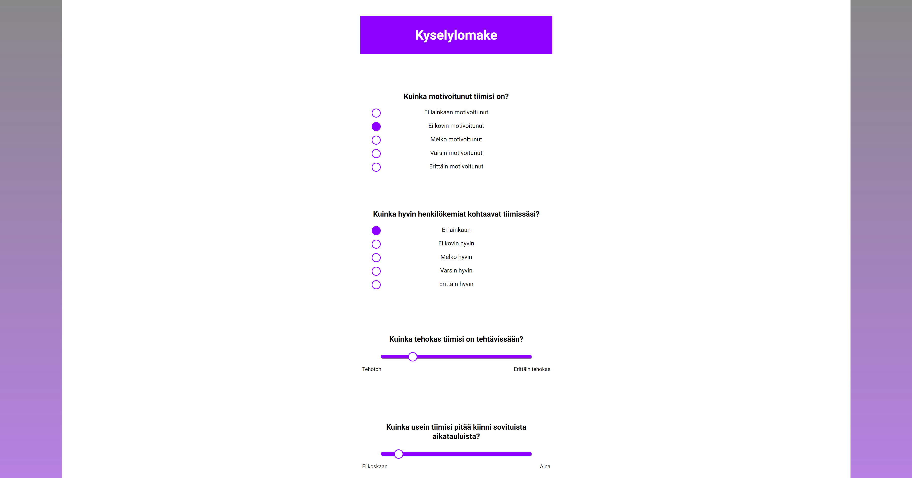
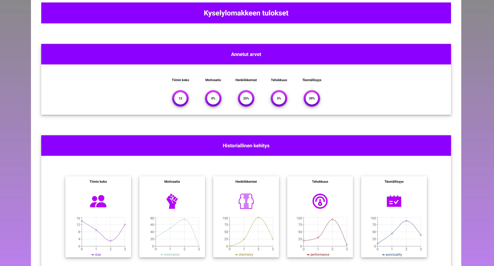

# Tiimin arviointilomake

This project was bootstrapped with [Create React App](https://github.com/facebook/create-react-app).

## Harjoitustyön tarkoituksena on luoda prototyyppisovellus alla olevien vaatimusten mukaisesti.

### Sovelluksen kuvaus

Sovellus on suunnattu henkilöille, jotka työskentelevät vaihtelevien projektien parissa. Sovelluksen avulla käyttäjä voi arvioida tiiminsä usealla eri parametrilla ja tutkia tämän tiedon avulla tiiminsä tehokkuutta. 

### Käyttäjätarinat

1. Tiimin jäsenenä haluaisin arvioida tiimin motivaatiota, sillä haluaisin tutkia jälkikäteen tämän vaikutusta projektityöhön.
  
2. Tiimin jäsenenä haluaisin arvioida tiimini henkilökemioita, sillä haluaisin tutkia jälkikäteen tämän vaikutusta projektityöhön.
  
3.	Tiimin jäsenenä haluaisin arvioida tiimin tehokkuutta tehtävissään, sillä haluaisin tutkia jälkikäteen tämän vaikutusta projektityöhön.
  
4. Tiimin jäsenenä haluaisin arvioida tiimin täsmällisyyttä, sillä haluaisin tutkia jälkikäteen tämän vaikutusta projektityöhön.
  
5. Tiimin jäsenenä haluaisin tietää tiimin koon, sillä haluaisin tutkia jälkikäteen tämän vaikutusta muihin annettuihin parametreihin.

### Käyttötapaus 1: Kyselylomakkeen täyttäminen
  
Kuvaus: Käyttäjä haluaa vastata kysymyksiin mahdollisimman nopeasti ja vaivattomasti.
  
Esiehdot: Selain on ladannut ja piirtänyt kyselylomakkeen käyttäjän laitteelle
  
Tapahtuman kuvaus:
  1. Käyttäjä näkee kysymykset selkeästi eroteltuna.
  2. Käyttäjä pystyy vastaamaan kysymyksiin mahdollisimman helposti ja nopeasti.
  3. Käyttäjä saa virheilmoituksen, jos kysymyksiin ei ole annettu vastausta.
  4. Käyttäjä näkee selkeästi virheilmoituksen.
  5. Käyttäjä löytää lähetysnapin helposti.
  
### Käyttötapaus 2: Kyselyvastausten visualisointi
  
Kuvaus: Käyttäjä haluaa nähdä kyselyvastausten tulokset visuaalisesti esitettynä.
  
Esiehdot: Kyselylomakkeen lähetysnappia on painettu.
  
Tapahtuman kuvaus:
  1. Käyttäjä näkee keskeiset tulokset selkeästi ensinäkemällä.
  2. Käyttäjän tulokset on esitetty numeerisesti, kaavioiden ja kuvien avulla.
  3. Käyttäjä voi tutkia historiallista dataa.
  4. Käyttäjä voi laitteesta riippumatta ihailla tuloksiaan selkeästi.
  

## Sovelluksen esittely ja käyttöönotto
  
### Näkymät
  

  

  
  
### Sovelluksen käyttöönotto
  
1. Lataa repositorio
  
### `git clone https://github.com/Tommi-dev/talapp.git`
  
2. Mene ladatun repositorion juurihakemistoon ja asenna riippuvuudet
  
### `npm install`
  
3. Tarkasta riippuvuuksien turvallisuus
  
### `npm audit`
  
4. Käynnistä sovellus
  
### `npm start`
  
5. Käynnistä JSON serveri
  
### `npm run server`

6. Suorita testit
  
### `npm run test`